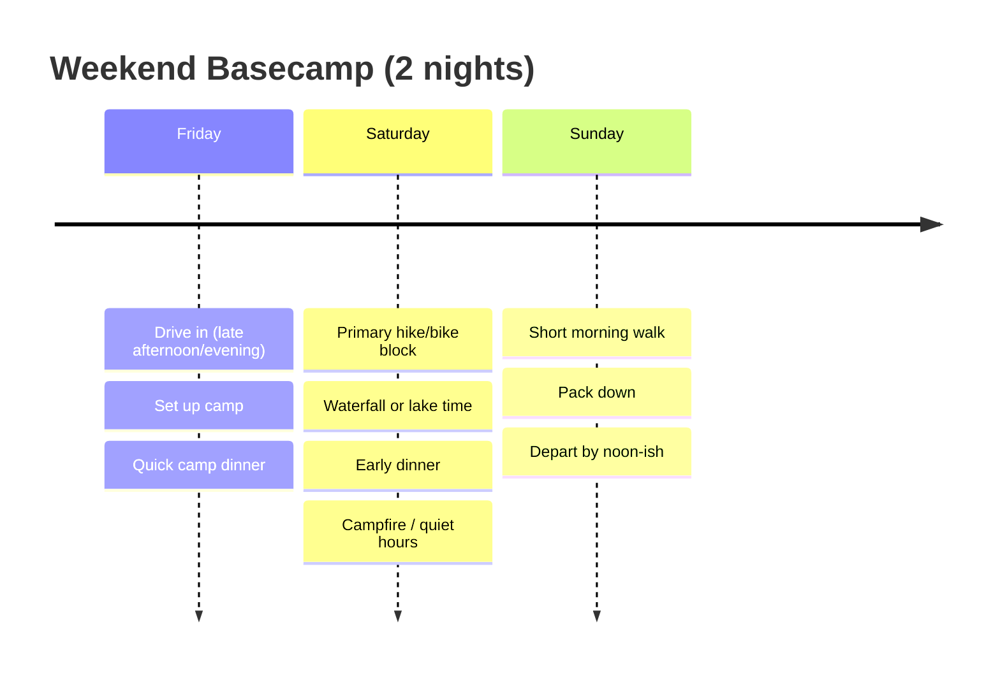
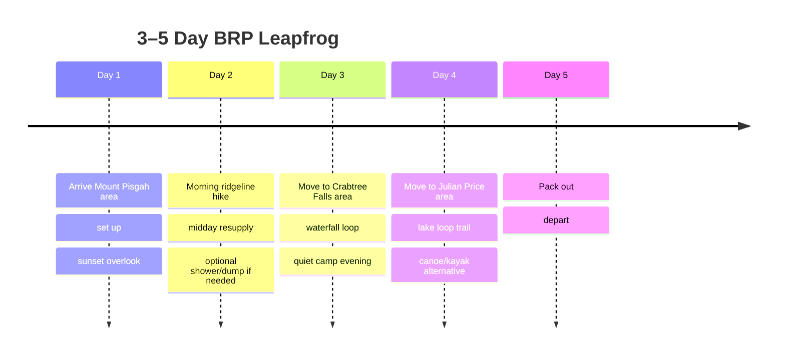

# Best Car-Camping Spots Within a Three-Hour Drive of Asheville

## Executive summary

This report identifies twelve high-value car-camping “anchors” within roughly a three-hour driving radius of Asheville, optimized for building a structured knowledge base (coordinates, amenities, access constraints, seasonality, regulations, safety, and comparative suitability). The short list intentionally mixes “high-amenity / easy logistics” campgrounds (especially near Asheville) with “scenic / solitude / shoulder-season” options across the southern Appalachians. Primary data comes from official sources (U.S. Forest Service, National Park Service, state park agencies) plus reservation platforms and recent user reports where official detail is sparse. citeturn30view0turn16view0turn10search4turn29view0turn17view0

Two “operational reality” caveats are especially important for an app: (1) storm recovery and infrastructure projects can change access and availability by season or year (e.g., Blue Ridge Parkway recovery work noted in official closure mapping, and partial campground-loop reopening announcements); and (2) several flagship campgrounds are explicitly affected by planned closures or limited openings over recent seasons, so live status checks should be modeled as first-class data (alerts, closures, and “open loop(s)” indicators). citeturn10search11turn10search5turn1search0turn16view0turn32search5

From the “best overall” perspective for a general car-camping audience, three sites stand out because they combine reliable infrastructure, strong recreation density, and approachable driving access: Lake Powhatan (highest amenity density near Asheville with some full-hookup capacity), Davidson River (classic “Pisgah hub” with dense waterfall/trail access), and the Blue Ridge Parkway’s Mount Pisgah / Julian Price tandem for high-elevation summer comfort plus iconic Parkway scenery. citeturn30view0turn16view0turn6view6turn10search4turn5view4

For “solitude + wildlife” within the radius, Cataloochee (Great Smoky Mountains) is the most distinctive anchor—remote valley vibe, strict access-road length guidance, and frequent wildlife presence—but it requires careful trip planning due to limited cell coverage and narrow/gravel access segments. citeturn19search7turn8search13turn5view7

## How this report was built

Selection prioritized developed, legal, car-accessible camping areas with: (a) high-quality official documentation, (b) clear access constraints (paved/gravel, rig length guidance), (c) demand signals (reservation requirements, reservable vs. first-come-first-served inventory), and (d) proximity to high-value trailheads or destination features (waterfalls, lakes, high-elevation ridgelines). citeturn10search4turn5view4turn5view5turn17view0turn19search7

Core sources included:
- entity["organization","National Park Service","us federal agency"] campground pages, rules, and recovery/closure maps for the entity["point_of_interest","Blue Ridge Parkway","nc-va scenic park road"] and entity["point_of_interest","Great Smoky Mountains National Park","nc-tn national park"]. citeturn10search4turn10search8turn10search11turn29view0turn10search2  
- entity["organization","USDA Forest Service","us federal agency"] recreation pages and facility directions/coordinates for National Forest campgrounds. citeturn30view0turn16view0turn17view0  
- entity["organization","Recreation.gov","federal reservations platform"] campsite-level pages (vehicle length, driveway surface, equipment types) and “campground overview” pages (amenities, FCFS vs. reservable counts, notices). citeturn31search2turn31search12turn32search0turn5view4turn5view6  
- State park systems and their reservation platforms (e.g., entity["company","ReserveAmerica","camping reservations platform"] for North Carolina parks), plus statewide rules like quiet hours for NC state parks. citeturn4search6turn4search12turn32search26turn4search9  

Limitations for a knowledge base: “nearest cell towers” are rarely published in official campground documentation; this report therefore treats “cell coverage” as (a) official warnings where provided, and (b) recent user reports where explicitly noted, leaving tower-level metadata as “unspecified” unless you integrate a coverage/tower dataset into the app. citeturn10search6turn6view6turn19search7turn31search19

## Comparative analysis across the top twelve sites

### Top twelve overview table

Drive times below are *estimates under normal conditions* (weather and Parkway closures can change them materially; for Parkway-focused trips, consult the official closure and detour mapping). citeturn10search11turn10search10

| Site (anchor) | Primary setting | Reservation system | Typical fee signal (source) | Site types (high level) | Cell coverage (best-available evidence) | Best season (why) |
|---|---|---|---|---|---|---|
| Lake Powhatan (Pisgah NF) | Lake + close-to-city forest | recreation.gov (USFS) citeturn30view0turn31search11 | Standard $37 / Electric $46 / Full Hookup $52 citeturn30view0 | Mixed: standard, electric, some full hookups; glamping available citeturn5view0turn30view0 | Mixed; user reports note variable hotspot performance by site/loop citeturn31search19turn6view6 | Spring–fall (lake, biking access; winter limited services) citeturn30view0 |
| Davidson River (Pisgah) | River corridor + waterfall hub | recreation.gov (USFS) citeturn16view0turn32search1 | Standard $35 / Electric $43 citeturn16view0 | Large developed campground; electric/non-electric; multiple loops citeturn16view0turn32search1 | Unspecified (plan for weak/spotty in forested valley) citeturn10search6turn19search7 | Late spring–fall (waterfalls; shoulder seasons quieter) citeturn16view0 |
| Standing Indian | High-basin forest near AT | mix: reservation + FCFS citeturn17view1turn17view0 | Single $20 / Double $40 citeturn17view0 | Developed loops; group area (Kimsey Creek) citeturn17view0turn17view1 | Unspecified | Summer–early fall (cooler elevation; hiking basin) citeturn17view0turn17view1 |
| Mount Pisgah (BRP) | High-elevation ridgeline | recreation.gov (NPS) citeturn5view3turn10search4 | Typical BRP fee context: $30/night, reservable + FCFS citeturn10search4turn10search8 | Tent + RV (no hookups); showers available (two BRP campgrounds) citeturn10search4turn6view6 | “Minimal” reception warning citeturn6view6turn10search6 | Summer (cooler at ~5k ft); fall views (crowds) citeturn9search7turn10search4 |
| Julian Price (BRP) | Lake + trail network | recreation.gov (NPS) citeturn5view4turn10search4 | BRP fee context + reservable/FCFS availability citeturn10search4turn10search8 | 75 reservable + 115 FCFS sites citeturn5view4 | Unspecified (treat as variable along Parkway) citeturn10search6 | Summer–fall (lake loop + Tanawha access) citeturn10search9turn10search7 |
| Crabtree Falls (BRP) | Waterfall recreation area | recreation.gov (NPS) citeturn5view5turn10search4 | BRP fee context; 27 reservable + 54 FCFS citeturn5view5turn10search4 | RV loop + tent/van loops; no hookups; dump station citeturn5view5turn4search13 | Unspecified | Summer–fall (waterfall hike; cooler nights) citeturn4search10turn10search4 |
| Smokemont (GSMNP) | River + big-park access | recreation.gov (NPS) citeturn5view6turn29view0 | GSMNP frontcountry: reservations required citeturn29view0 | Large developed campground; no standard hookups; dump station present citeturn5view6turn29view0 | Plan for limited coverage; park warns not to rely on cell citeturn10search6turn19search7 | Spring & fall (wildflowers/fall color; summer humid) citeturn10search2turn8search8 |
| Cataloochee (GSMNP) | Remote valley + wildlife | recreation.gov (NPS) citeturn19search7turn5view7 | Reservations required; plan ahead due to limited cell citeturn19search7 | Developed but small/remote (flush toilets + potable water; no showers/hookups) citeturn19search7 | “Very limited” coverage; reservation required before arriving citeturn19search7 | Spring & fall (elk common; fewer crowds vs. main corridors) citeturn19search7turn8search13 |
| Lake James State Park (Paddy’s Creek area) | Lakeside state park | ReserveAmerica (NC Parks) citeturn4search6turn4search12 | Drive-in no-hookups sites: $30/night incl. $3 fee citeturn4search12turn4search27 | Drive-in tent sites + other access types (walk-in/paddle-in elsewhere in park) citeturn4search12turn4search3 | Unspecified | Summer (lake), shoulder seasons for crowd relief citeturn4search3 |
| South Mountains State Park | Waterfalls + rugged trails | Unspecified (NC Parks system) citeturn32search26turn4search9 | NC state park camping rate structure published; site-specific fee unspecified citeturn4search9 | Mostly non-electric with limited electric sites (user reports) citeturn3search28 | Unspecified | Spring–fall (waterfalls; avoid peak foliage weekends) citeturn3search28 |
| Roan Mountain State Park (TN) | High-mountain valley basecamp | TN State Parks system | Unspecified | Developed campground (details unspecified) | Unspecified | Summer (cooler); fall (colors) |

### Practical suitability ranking

Scores below are an app-friendly *relative* index (1=poor, 5=excellent), derived from documented access constraints, amenities, and setting. Where official data is incomplete, scoring is conservative.

| Site | Tents | Small SUVs/vans | Large RVs | Families | Solitude | Stargazing |
|---|---:|---:|---:|---:|---:|---:|
| Lake Powhatan | 4 | 5 | 4 (some full hookup + paved driveways) citeturn31search2turn31search12turn30view0 | 5 | 2 | 3 |
| Davidson River | 5 | 5 | 4 (length varies by site) citeturn32search0turn16view0 | 5 | 2 | 2 |
| Standing Indian | 4 | 5 | 3 | 4 | 3 | 3 |
| Mount Pisgah (BRP) | 4 | 5 | 3 (limited over 30’ sites) citeturn10search8turn6view6 | 4 | 3 | 5 |
| Julian Price (BRP) | 4 | 5 | 3 (limited over 30’ sites) citeturn10search8turn5view4 | 5 | 2 | 4 |
| Crabtree Falls (BRP) | 4 | 5 | 3 (some long pull-throughs; variable terrain/steps) citeturn4search13turn4search17 | 4 | 4 | 4 |
| Smokemont (GSMNP) | 4 | 5 | 3 | 5 | 2 | 2 |
| Cataloochee (GSMNP) | 4 | 5 | 1–2 (access road length guidance) citeturn5view7turn19search7 | 4 | 5 | 3 |
| Lake James SP | 4 | 5 | 2–3 (hookups not indicated for drive-in tent area) citeturn4search12 | 5 | 3 | 3 |
| South Mountains SP | 4 | 5 | 2 (limited electric sites per user report) citeturn3search28 | 4 | 4 | 3 |
| Roan Mountain SP | 4 | 5 | 3 | 4 | 3 | 4 |
| Black Rock Mountain SP | 4 | 4 (steep grade) citeturn4search2turn3search37 | 2–3 | 4 | 4 | 5 |

image_group{"layout":"carousel","aspect_ratio":"16:9","query":["Lake Powhatan Campground Asheville NC","Davidson River Campground Pisgah Forest NC","Mount Pisgah Campground Blue Ridge Parkway","Cataloochee Valley elk campground"],"num_per_query":1}

## Site profiles for the recommended anchors

Notation: if a detail is not clearly specified in the sources reviewed, it is labeled **Unspecified**. “Drive time from Asheville” is an estimate intended for planning and should be treated as variable (weather, traffic, closures). Official maps/alerts should be checked for Parkway segments due to ongoing storm recovery and construction. citeturn10search11turn10search10

### entity["point_of_interest","Lake Powhatan Campground","Pisgah NF | Asheville, NC"]

| Attribute | Value |
|---|---|
| GPS coordinates | 35.48295924, -82.62959961 citeturn30view0 |
| Estimated drive time from Asheville | ~15–30 minutes (estimate) |
| Elevation | ~2,200 ft citeturn8search14 |
| Access routes & road conditions | Signed access from NC-191 area; campground is car-accessible; internal driveways vary (paved or gravel). citeturn30view0turn31search4turn31search2 |
| 2WD/4WD suitability | 2WD suitable (developed campground). citeturn30view0 |
| Campsite types | Standard, electric, some full hookups; glamping tents. citeturn30view0turn31search11 |
| Vehicle length limits (range sample) | Examples: Site 026 max 28’ (FHU); Site 041 max 35’; Site 45/47 max vehicle length 40’. citeturn31search12turn31search2turn31search0 |
| Hookups | Some sites have electric; some have water/sewer (full hookups). citeturn31search12turn30view0turn31search2 |
| Picnic table / fire ring / grill | Provided (campfire rings with grills; picnic tables). citeturn31search11turn30view0 |
| Restrooms & showers | Flush toilets + showers documented on USFS and recreation.gov pages. citeturn30view0turn31search11 |
| Potable water | “Potable water is available” (USFS). citeturn30view0 |
| Cell coverage | Mixed; recent user reports note variable hotspot performance by loop/site. Treat as “variable.” citeturn31search19turn10search6 |
| Nearest cell towers | Unspecified (not in official documentation). citeturn10search6 |
| Pets | Pets allowed at least on campsite-level pages; leash rules not fully specified on the sampled site pages. citeturn31search2turn31search12 |
| Reservation system & fees | Reservations via recreation.gov; fee structure published by USFS ($37/$46/$52 tiers). citeturn30view0turn31search11 |
| Peak seasons & typical occupancy | Peak season implied by staffed gatehouse hours; expect high demand due to proximity to Asheville and amenities (occupancy not officially quantified). citeturn30view0turn31search11 |
| Nearby trailheads/attractions | Borders entity["point_of_interest","Bent Creek Experimental Forest","Asheville, NC region"] (major biking/hiking zone). citeturn30view0 |
| Permit requirements | Standard reservation/fee rules; no special permit noted beyond campground rules. citeturn31search11turn30view0 |
| Fire restrictions | Fires in provided rings; “Don’t Move Firewood” messaging present; check current forest restrictions. citeturn31search11turn30view0 |
| Generator rules | Unspecified (site-level rules not captured in the reviewed snippets). |
| Quiet hours | Unspecified |
| ADA accessibility | Some ADA sites exist per third-party compilation; official ADA count unspecified here (verify on reservation platform). citeturn31search15 |
| Safety hazards | General bear risk in WNC forests is a planning assumption; site-specific bear language not in the captured Lake Powhatan snippets. |
| RV dump availability | Water fill and dump station referenced at campsite level (“Water fill and dump station are available at the campground.”). citeturn31search4 |
| Official/operational maps | Campground map PDF available from operator documentation. citeturn31search27 |

### entity["point_of_interest","Davidson River Campground","Pisgah NF | Pisgah Forest, NC"]

| Attribute | Value |
|---|---|
| GPS coordinates | 35.28083, -82.7225 citeturn16view0 |
| Estimated drive time from Asheville | ~45–70 minutes (estimate) |
| Elevation | 2,150 ft citeturn16view0 |
| Access routes & road conditions | Paved highway access via NC-280/US-276 with signed campground turn. citeturn16view0 |
| 2WD/4WD suitability | 2WD suitable (developed campground). citeturn16view0 |
| Campsite types | Multiple loops; standard + electric sites; some sites adjacent to water. citeturn16view0turn32search1 |
| Vehicle length limits (range sample) | Example: Site 003 max RV/trailer length 45’ with gravel driveway. citeturn32search0 |
| Hookups | Electric site category exists (fees published for “Electric campsite”). citeturn16view0turn32search1 |
| Picnic table / fire ring / grill | Sites equipped with picnic tables and campfire rings with grills. citeturn16view0 |
| Restrooms & showers | Narrative: “hot showers and restrooms with flush toilets in each loop.” citeturn16view0 |
| Potable water | Unspecified in the captured fields; narrative describes developed amenities (verify by loop/season). citeturn16view0 |
| Cell coverage | Unspecified (treat as variable in river valley). citeturn10search6turn19search7 |
| Nearest cell towers | Unspecified |
| Pets | Allowed, leash/containment required; dog fences not allowed (recreation.gov). citeturn5view1 |
| Reservation system & fees | recreation.gov; fees published by USFS ($35 standard / $43 electric). citeturn16view0turn32search1 |
| Current/near-term operational notice | Closure alert: closed Nov 2025–May 2026 for major upgrades (USFS + operator collaboration). citeturn32search5turn32search19 |
| Nearby trailheads/attractions | entity["point_of_interest","Sliding Rock","Pisgah NF | Brevard, NC"] and entity["point_of_interest","Looking Glass Falls","Pisgah NF | Brevard, NC"] are listed as nearby attractions, plus the Blue Ridge Parkway. citeturn16view0turn15view0 |
| Permit requirements | Standard reservation/fee rules. citeturn32search1turn16view0 |
| Fire restrictions | Unspecified; treat as fire-ring use + forest restrictions as posted. |
| Generator rules | Unspecified officially in captured sources. |
| Quiet hours | Unspecified officially in captured sources. |
| ADA accessibility | Unspecified (verify via reservation platform). |
| Safety hazards | River-use hazards exist (tubing/swimming); bear food storage is generally required in many forest campgrounds, but this specific requirement is not captured in the official snippets above. citeturn16view0turn19search7 |
| RV dump availability | Unspecified |
| Official/operational maps | “Pisgah Ranger District Developed Campgrounds” PDF lists Davidson River rules and map. citeturn32search2 |

### entity["point_of_interest","Standing Indian Campground","Nantahala NF | Franklin, NC"]

| Attribute | Value |
|---|---|
| GPS coordinates | 35.073428, -83.530105 citeturn17view0 |
| Estimated drive time from Asheville | ~1h 45m–2h 30m (estimate) |
| Elevation | 3,880 ft citeturn17view1 |
| Access routes & road conditions | Directions specify Forest Road 67 is paved to the campground area. citeturn17view1turn17view0 |
| 2WD/4WD suitability | 2WD suitable (paved route described). citeturn17view1turn17view0 |
| Campsite types | Multiple loops; mix of reservable and FCFS; group camping area (Kimsey Creek). citeturn17view1turn17view0 |
| Vehicle length limits | Unspecified (site-level lookup needed). |
| Hookups | “No electric, water or sewer hookups available” (recreation.gov). citeturn17view1 |
| Picnic table / fire ring / grill | Fire-ring grills, lantern posts, and picnic tables described on USFS page; recreation.gov lists campfire rings & grills. citeturn17view0turn17view1 |
| Restrooms & potable water (data conflict) | USFS narrative says close proximity to drinking water, flush toilets and showers, but the same page’s amenity fields state restrooms and potable water are “not available”; recreation.gov also states drinking water, flush toilets, and showers, plus a nearby dump station. Treat as **available but verify** in your app data model. citeturn17view0turn17view1 |
| Cell coverage | Unspecified |
| Pets | Leash required; additional pet rules and 14-day limit specified. citeturn17view0 |
| Reservation system & fees | USFS lists $20 single / $40 double; season April 1–Oct 30; quiet hours 10pm–6am. citeturn17view0 |
| Nearby trailheads/attractions | Access to the entity["point_of_interest","Appalachian Trail","eastern us long-distance trail"] is explicitly noted. citeturn17view0turn5view2 |
| Fire restrictions | Unspecified; “Don’t Move Firewood” guidance present. citeturn17view0turn17view1 |
| Generator rules | Unspecified |
| ADA accessibility | Unspecified |
| RV dump availability | “Dump station is nearby” (recreation.gov). citeturn17view1 |
| Official map | Unspecified |

### entity["point_of_interest","Mount Pisgah Campground","Blue Ridge Pkwy | Canton, NC"]

| Attribute | Value |
|---|---|
| GPS coordinates | 35.40278, -82.75667 (NPS). citeturn9search1 |
| Estimated drive time from Asheville | ~35–60 minutes (estimate) |
| Elevation | ~4,980 ft (recreation.gov). citeturn9search7 |
| Access routes & road conditions | Access via the Blue Ridge Parkway; directions given from I‑40/NC‑191 and from Waynesville via NC‑276; note: GPS may be unreliable. citeturn6view6turn10search6 |
| 2WD/4WD suitability | 2WD suitable (developed Parkway campground). citeturn10search4 |
| Campsite types | RV and tent sites; mix of reservable + FCFS. citeturn5view3turn6view6 |
| Hookups | “Electric, water, or sewer hook-ups are not available per site.” citeturn6view6 |
| Restrooms & potable water | Flush toilets + drinking water + dump station listed at campground overview; showers in Loop B and Loop C. citeturn5view3turn6view6turn10search4 |
| Cell coverage | “Cell phone reception is minimal in this area.” citeturn6view6 |
| Pets | Unspecified at the campground level in captured sources (verify on recreation.gov for specific sites). |
| Bear / wildlife safety | Extensive bear food-storage requirements are listed on recreation.gov. citeturn6view6 |
| Firewood restriction | Heat-treated firewood requirement is explicitly stated for the Parkway. citeturn6view6turn10search4 |
| Generator rules | Prohibited 9:00 pm–8:00 am (recreation.gov). citeturn6view6 |
| Quiet hours | Unspecified as a distinct field for BRP in captured sources (many NPS campgrounds commonly align with 10–6; verify on-site). |
| ADA accessibility | Parkway-wide note: at least one accessible site/restroom at all campgrounds except Rocky Knob (VA). citeturn10search8 |
| Nearby trailheads/attractions | Trails named: entity["point_of_interest","Shut-In Trail","Blue Ridge Pkwy | NC"], entity["point_of_interest","Frying Pan Trail","Blue Ridge Pkwy | NC"], and Buck Spring Trail, plus proximity to Pisgah Inn. citeturn6view6 |
| Official map | Parkway campground maps referenced via NPS camping resources; specific file not captured. citeturn10search4turn10search11 |

### entity["point_of_interest","Julian Price Campground","Blue Ridge Pkwy | Blowing Rock, NC"]

| Attribute | Value |
|---|---|
| GPS coordinates | 36.13889, -81.73111 (NPS). citeturn10search1 |
| Estimated drive time from Asheville | ~2h 0m–2h 45m (estimate) |
| Campsite inventory | 75 reservable + 115 FCFS sites. citeturn5view4 |
| Amenities baseline | BRP campgrounds generally include potable water, flush toilets, dump station; showers available at Julian Price + Mount Pisgah. citeturn10search4 |
| Hookups | BRP campgrounds: no standard water/electric hookups. citeturn10search8 |
| Trail/attraction density | Lake-loop and through-trails: Boone Fork Trail, Price Lake loop, Tanawha Trail (access points described on NPS trail page). citeturn10search9turn10search7 |
| Recent operational context | NPS announced partial opening (Loop A) in 2025 with other loops closed due to ongoing debris/tree and water-system repairs, tied to Helene recovery; verify current-year loop status via official closures info. citeturn10search5turn10search11 |
| Other attributes | **Unspecified** (vehicle length ranges, generator specifics, cell coverage vary; consult recreation.gov site details and Parkway regulations). citeturn10search8turn10search6 |

### entity["point_of_interest","Crabtree Falls Campground","Blue Ridge Pkwy | Marion, NC"]

| Attribute | Value |
|---|---|
| GPS coordinates | 35.812467, -82.142416 (non-official directory value; verify against NPS mapping). citeturn4search21turn10search11 |
| Campsite inventory | 27 reservable + 54 FCFS (in-person kiosk for FCFS). citeturn5view5 |
| Amenities | Flush toilets, drinking water, dump station; grills/fire rings + picnic tables. citeturn5view5 |
| Hookups | “No electric, water, or sewer hook-ups are available.” citeturn13search1 |
| Vehicle length examples | Site 1: RV max length 43’ with paved, pull-through driveway; other sites vary and may involve steps down to tables/fire pits. citeturn4search13turn4search17 |
| Nearby attraction | entity["point_of_interest","Crabtree Falls","Blue Ridge Pkwy | NC"] loop hike described by NPS (scenic loop to waterfall). citeturn4search10turn13search11 |
| Cell coverage | Unspecified |
| Quiet hours / generators | Unspecified here; consult Parkway regulations and site notices. citeturn10search8turn10search4 |
| Official map | Unspecified (campground map referenced through NPS/BRP resources). citeturn10search4turn10search11 |

### entity["point_of_interest","Smokemont Campground","GSMNP | Cherokee, NC"]

| Attribute | Value |
|---|---|
| GPS coordinates | **Unspecified** in official snippets reviewed; Bradley Fork Trailhead within Smokemont is documented at 35.56302, -83.31074 (use as approximate in-app “camp core” unless you add an authoritative campground centroid). citeturn8search23 |
| Elevation | ~2,200 ft citeturn8search8 |
| Hookups & showers | “No showers or electric, water or sewer hook-ups in the park” (with limited 5-amp medical outlets at some accessible sites). citeturn5view6turn29view0 |
| Quiet hours | 10 pm–6 am (site-level rule shown). citeturn5view6turn29view0 |
| Generator rules | Detailed restriction rules by loop; baseline generator window is restricted (see site rule text). citeturn5view6 |
| Fires | Allowed in fire rings only (site-level rule). citeturn5view6 |
| Pets | Leash ≤6 ft; pets limited to roads and two trails; not allowed on other park trails. citeturn8search0turn29view0 |
| Dump station | Dump stations with potable water include Smokemont. citeturn29view0 |
| Map | Official Smokemont campground map PDF. citeturn8search16 |
| Permit requirements | Parking tags required for vehicles parked >15 minutes; campers at their designated campsite are not required to have a tag at the campsite. citeturn29view0 |

### entity["point_of_interest","Cataloochee Campground","GSMNP | Waynesville, NC"]

| Attribute | Value |
|---|---|
| GPS coordinates | **Unspecified** in the sources captured here (official map PDF provided; add centroid later via an authoritative GIS dataset). citeturn8search9 |
| Access-road constraint | Narrow, winding mountain road; 3-mile gravel stretch with blind curves; motorhomes over 29’ and trailers over 25’ not recommended. citeturn5view7turn19search7turn8search13 |
| Campsite features | Flush toilets + drinking water; no hookups or showers. citeturn19search7turn5view7 |
| Quiet hours / generators | Quiet hours 10 pm–6 am; generators restricted 8 am–8 pm. citeturn5view7turn29view0 |
| Pets | Allowed but cannot be left unattended; leash required; pets not allowed on trails. citeturn5view7turn19search7 |
| Cell coverage | “Very limited”; reservation required before driving in due to lack of ability to book on-site. citeturn19search7 |
| Wildlife/bear safety | Bear habitat rules include strict storage requirements; warnings about negative human-bear encounters appear in campground notices. citeturn19search7 |
| Map | Official Cataloochee campground map PDF. citeturn8search9 |
| Permit requirements | Parking tag policy applies park-wide (see frontcountry camping rules); campers at their site exempt for the campsite. citeturn29view0turn19search7 |

### entity["point_of_interest","Lake James State Park","North Carolina state park"]

This anchor is treated as “Lake James—Paddy’s Creek drive-in camping,” because official NC Parks documentation distinguishes camping by access area.

| Attribute | Value |
|---|---|
| Location context | Park is described as 50 miles northeast of Asheville, spanning Burke and McDowell counties. citeturn4search3 |
| GPS coordinates | **Unspecified** (official page reviewed doesn’t publish a single campground centroid). citeturn4search3turn4search12 |
| Campsite types | Drive-in tent sites at Paddy’s Creek access are “no hookups,” plus other camping types at other accesses (walk-in/paddle-in). citeturn4search12turn4search3 |
| Fees | $30/night for “no hookups” drive-in sites at Paddy’s Creek (includes $3 reservation fee). citeturn4search12turn4search27 |
| Reservation system | ReserveAmerica booking window: can reserve up to 6 months in advance; some categories require at least 1 day ahead (varies by item). citeturn4search6 |
| Other attributes | **Unspecified** (vehicle length limits, dump station, generator rules, and cell coverage should be pulled from park-specific pages and/or reservation site details). citeturn4search3turn4search6 |

### entity["point_of_interest","South Mountains State Park","Connelly Springs, NC"]

| Attribute | Value |
|---|---|
| GPS coordinates | Unspecified |
| Campsite mix | User reports suggest most sites are non-electric with a small number of electric sites; bathhouse includes showers. (Treat as non-authoritative until verified on NC Parks pages.) citeturn3search28 |
| Quiet hours baseline | NC State Parks quiet hours: 10 pm–7 am (system-wide guidance). citeturn32search26 |
| Other attributes | **Unspecified** (hookups, dump station, pad sizes, length limits, and reservation platform specifics). |

### entity["point_of_interest","Roan Mountain State Park","Tennessee state park"]

| Attribute | Value |
|---|---|
| GPS coordinates | Unspecified |
| Reservation system | TN State Parks reservation portal exists (campground specifics not captured in reviewed snippet). citeturn3search29 |
| RV dump | Strategic plan references “two new dump stations” as a recommendation (not a guarantee of current state). citeturn3search25 |
| Other attributes | **Unspecified** (current hookups, restrooms, generator rules, quiet hours). |

### entity["point_of_interest","Black Rock Mountain State Park","Mountain City, GA"]

| Attribute | Value |
|---|---|
| GPS coordinates | N 34.9069220, W -83.4083750 citeturn3search37 |
| Access constraint | “Steep grade” warning; app should flag “grade/rig caution.” citeturn4search2 |
| Fees/permits | ParkPass required for vehicles (ReserveAmerica detail page). citeturn4search2 |
| Reservation system | ReserveAmerica (Georgia State Parks). citeturn4search2turn3search37 |
| Amenities (non-official compilation) | Drinking water, flush toilets, showers, trash, sewage dump station (3rd-party campsite photo compilation; verify against GA official docs in app pipeline). citeturn4search19 |
| Other attributes | **Unspecified** (exact per-loop length limits, hookups by site class, generator rules, quiet hours). |

## Suggested sample itineraries with mermaid timelines

These itineraries are intentionally “app-structured”: every day has a campsite anchor, a primary activity block, a resupply block, and an optional “bad weather” fallback. Trail/activity references come from the official campground/trail pages cited below.

### Weekend itinerary near Asheville

Concept: maximum recreation density with minimal logistics.

- **Basecamp option A:** Lake Powhatan (close-to-city, biking access via Bent Creek area). citeturn30view0turn31search11  
- **Basecamp option B:** Davidson River (waterfall corridor + Pisgah hub; note potential seasonal closure window for upgrades). citeturn16view0turn32search5  

If you build this into an app, treat “storm closures / construction” as a hard pre-check (especially for Parkway segments and forest roads). citeturn10search11turn16view0

### Three- to five-day Blue Ridge Parkway sampler

Concept: leapfrog between Parkway campgrounds for cool temperatures and varied trail access. Parkway campgrounds are generally seasonal (May through late October, conditions permitting), reservations run through recreation.gov, and dump stations are broadly available per Parkway camping guidance. citeturn10search4turn10search8turn5view3turn5view4

Suggested anchor sequence:
- Mount Pisgah (high elevation; trails listed on recreation.gov). citeturn6view6turn9search7  
- Crabtree Falls (waterfall loop hike). citeturn4search10turn5view5  
- Julian Price (lake loop + Tanawha Trail access). citeturn10search9turn5view4  

Because the Parkway has documented storm recovery activity and loop-level campground changes, your app should link each itinerary day to official “road status and closures” and the “Helene impacts and recovery” planning resources. citeturn10search10turn10search11turn10search5

## Packing checklists, planning tips, and safety guidance

### Packing checklists for car camping

A useful knowledge-base approach is to store packing as modular “kits” that can be toggled per site attributes (hookups/no hookups, showers/no showers, bear risk messaging, steep access roads, lake vs. river vs. ridgeline).

**Universal car-camping kit (baseline):**
- **Shelter & sleep:** tent or vehicle sleep system; ground insulation; temperature-rated bag/quilt appropriate for elevation (Parkway campgrounds are high and can run cooler; Mount Pisgah is ~5,000 ft). citeturn9search7turn10search4  
- **Cooking & water:** stove + fuel; lighter/matches; water containers; method to treat/filter water if potable water is uncertain. (Even where potable water exists, outages happen seasonally.) citeturn10search4turn30view0turn17view0  
- **Food storage:** hard-sided storage or locker strategy where bear rules are explicit (e.g., Mount Pisgah requires storing scented items in locked vehicle/lockers; Cataloochee has strict bear-habitat storage language). citeturn6view6turn19search7  
- **Lighting & power:** headlamps, spare batteries, car charger, and (optionally) a small battery pack—especially where cell coverage is minimal and you may be relying on offline mapping. citeturn10search6turn6view6turn19search7  
- **Sanitation:** toilet paper, hand sanitizer, trash bags; expect vault/flush depending on agency (BRP and many developed sites list flush toilets; GSMNP frontcountry lists flush toilets and cold running water). citeturn10search4turn29view0  

**Mountain/high-elevation add-ons (BRP focus):**
- Warmer layers and rain protection (weather changes quickly in mountains; GSMNP weather guidance emphasizes large temperature variation with elevation and rapid shifts). citeturn10search2  
- Wind-resistant stakes/guylines; a backup “no campfire” plan (because fire restrictions can tighten with conditions). citeturn10search2turn19search7  

**Lakeside add-ons (Lake James / Lake Powhatan):**
- Swim gear, quick-dry towel, water shoes.
- Extra insect management (not site-sourced here; treat as seasonal best practice).

### Trip planning tips that map cleanly to app features

- **Reservation strategy:**  
  - Parkway campgrounds: reservable via recreation.gov up to six months in advance; also maintain FCFS inventory that cannot be tracked online. citeturn10search4turn5view4turn5view5  
  - NC State Parks: fees and reservation service fee are published, and ReserveAmerica shows booking windows (often up to six months ahead). citeturn4search12turn4search27turn4search6  
  - GSMNP frontcountry: advance reservations required; parking-tag rules apply for vehicles parked outside the campsite context. citeturn29view0  

- **Campsite selection heuristics:**  
  - For RV length fit: harvest and store site-level `max_vehicle_length`, `driveway_surface`, and `driveway_entry` (pull-through/back-in) directly from campsite pages (examples shown for Lake Powhatan and Davidson River). citeturn31search12turn31search2turn32search0  
  - For accessibility: treat “steps down to table/fire pit” as a separate constraint flag (Crabtree Falls site notes explicitly mention stairs). citeturn4search17turn4search28  
  - For noise: encode generator rules by campground (GSMNP provides explicit time windows; Mount Pisgah gives a clear generator curfew window). citeturn5view6turn6view6turn29view0  

- **Firewood and invasive pest control:**  
  - Parkway and Smokies have explicit heat-treated firewood restrictions; the Smokies also direct campers to check official “Firewood FAQs” and list where on-site sales occur. citeturn6view6turn29view0turn8search0  

### Safety, emergency, and communications guidance

- **Do not assume cell coverage:** Parkway FAQs explicitly warn that cell phones don’t work in many locations and GPS can be unreliable—your app should cache offline maps and provide a “known-signal spots” feature. citeturn10search6turn6view6turn19search7  
- **Emergency contacts:**  
  - For the Blue Ridge Parkway, the FAQ instructs users to dial 911 for emergencies and provides a communications center number for missing/overdue hikers. citeturn10search6  
  - For GSMNP, park pages provide the main contact number, and the weather page provides a phone extension for forecasts—useful for “no data” conditions. citeturn11view3turn10search2turn29view0  

- **Bear safety:**  
  - Mount Pisgah campground rules require storing food/scented items in vehicles/lockers and warn that bears frequent the area. citeturn6view6  
  - Cataloochee campground notices include bear-encounter statistics plus strict storage requirements, and it’s specifically described as bear habitat. citeturn19search7  

## Seasonal considerations, road access, and risk notes

- **Spring volatility:** Mountain weather can swing rapidly (GSMNP weather guidance explicitly describes spring unpredictability and elevation-driven variation). citeturn10search2  
- **Summer heat vs. elevation comfort:** Smokemont and other low-to-mid elevation campgrounds can be humid; higher elevations are generally cooler (Smokemont’s climate description and broader GSMNP elevation guidance support building an “elevation comfort” model). citeturn8search8turn10search2  
- **Fall foliage crowds:** Expect peak-night demand across the Parkway and popular forest corridors; where FCFS inventory exists (Julian Price, Crabtree Falls, Mount Pisgah), your app should model “arrive early” recommendations and show FCFS counts separately because they can’t be tracked online. citeturn5view4turn5view5turn5view3  
- **Winter access:** Parkway campgrounds are seasonal and closed in winter; NC/USFS campgrounds may remain open with “limited services” in winter months (explicitly stated for Lake Powhatan). citeturn10search4turn30view0  
- **Storm recovery and closures:** Official Parkway maps highlight storm recovery (including Helene impacts) and provide detours/reopening targeting; USFS pages also show Helene-related closures and alerts, and some individual campgrounds have documented upgrade closures (e.g., Davidson River closure window). citeturn10search11turn16view0turn32search5turn10search5