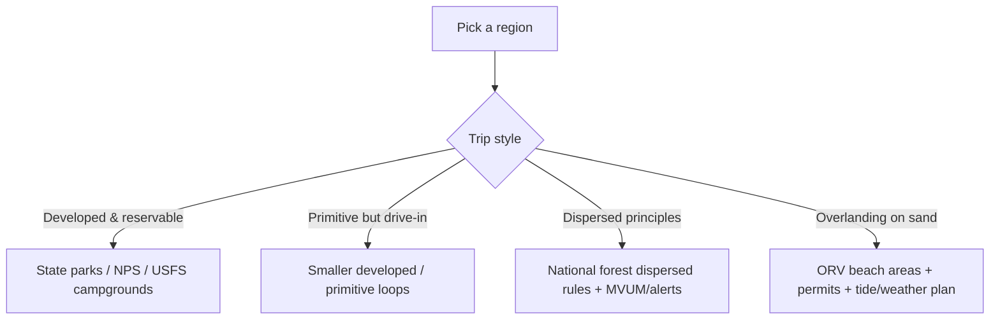

# Best Campgrounds by Region in North Carolina

## Executive summary

North Carolina’s best car-camping and overlanding options cluster into three “systems” that behave very differently: state parks (booked through a single reservation platform, generally consistent facilities), federal frontcountry campgrounds (booked through a federal platform, varying amenities and seasons), and dispersed/vehicle beach camping (rule-heavy, weather-dependent, and equipment-sensitive). citeturn35view1turn39view3turn43search2turn44search16turn45search15

Two short-term operational realities matter right now (late March 2026). First, multiple **North Carolina State Parks** pages prominently display a **statewide burn ban** notice, meaning no campfires at state parks until lifted; you should plan on gas/charcoal cooking as allowed and verify current park alerts close to departure. citeturn35view0turn37view1 Second, some mountain infrastructure is still recovering from storm impacts: **entity["point_of_interest","Davidson River Campground","campground near brevard, nc"]** is listed as closed until **May 1, 2026**, and **Linville Falls Campground** is reported closed to all camping in 2026 due to storm impacts—both of which can significantly reshape “best of” lists for the season. citeturn9search11turn11search5

The table below highlights a few “anchor picks” (each is also fully specified in its region section).  

| Use-case | Strong candidates | Why they stand out |
|---|---|---|
| High-elevation summer relief | **Mount Pisgah Campground**; **Balsam Mountain Campground** | Very high elevations for cooler nights; classic Blue Ridge / Smokies atmosphere. citeturn0search7turn24search1turn24search0 |
| River-and-water-centric car camping | **Mortimer Campground**; **Smokemont Campground** | River/creek adjacency plus developed amenities; good for anglers and “basecamp” style trips. citeturn8search0turn4search20turn18view6turn22search17 |
| Quiet/remote developed camping | **Cataloochee Campground** | Small campground; remote valley setting; road access notes discourage large rigs—helps keep it quieter. citeturn21search0turn25view2turn17view5 |
| Hookups close to major metros | **Poplar Point** (Jordan Lake); **Lake Norman** hookups sites | Large inventory and full-hookup options; practical for RVs and quick weekends. citeturn35view1turn37view0turn32view0 |
| Oceanfront campground (no sand driving required) | **Cape Point / Frisco / Oregon Inlet / Ocracoke** (Cape Hatteras) | NPS campgrounds with clear site counts, seasons, and fees; reservable via Recreation.gov. citeturn43search2turn41search5 |
| True overlanding-on-sand experience | **Cape Lookout** (Core Banks) vehicle beach camping | Vehicle access via ferry + ORV permitting + beach-driving rules; 4WD considered essential per NPS brochure. citeturn44search0turn44search16turn44search12turn45search15 |

## Methods and source hierarchy

This guide prioritizes primary and official sources: **entity["organization","National Park Service","us federal agency"]**, **entity["organization","U.S. Forest Service","us federal agency"]**, and **entity["organization","North Carolina State Parks","state parks agency, nc"] pages first, then their reservation backends—**entity["organization","Recreation.gov","federal reservations portal"]** and **entity["company","ReserveAmerica","campground booking website"]**—for operational details like site counts, hookups, and fees. citeturn43search2turn39view3turn35view1turn37view0turn41search5

Where an official page does not plainly expose a requested field (most often: exact elevation or cell signal), entries explicitly mark that field as “not specified” rather than guessing. For dispersed camping and beach driving, rules and limitations are sourced directly from the managing agencies, including stay limits and equipment guidance. citeturn39view3turn44search16turn45search1turn45search15

## Western NC Mountains

The mountain west is where you get the biggest “environmental payoff” per mile: cooler temps with elevation, dense trail networks, trout water, and iconic scenic corridors. It’s also where road/season closures can matter most, so check alerts before you commit. citeturn0search7turn11search5turn9search11turn25view2

image_group{"layout":"carousel","aspect_ratio":"16:9","query":["Mount Pisgah Campground Blue Ridge Parkway","Cataloochee Valley campground Great Smoky Mountains","Balsam Mountain Campground Great Smoky Mountains","Pisgah National Forest campground river"],"num_per_query":1}

### Developed and drive-in campgrounds

| Name | Location (nearest town; forest/park) | Type | Reservable | Sites (approx) | Elevation | Water access | Key features | Best season | Vehicle requirements | Cell signal likelihood | Price range | Nearby trails/attractions |
|---|---|---|---|---:|---:|---|---|---|---|---|---|---|
| **entity["point_of_interest","Lake Powhatan Campground","campground near arden, nc"]** | Near Arden; **entity["point_of_interest","Pisgah National Forest","national forest, nc, us"]** | Developed | Yes—Recreation.gov citeturn3search10turn39view3 | ~98 citeturn9search20 | ~2,200 ft citeturn9search20 | Developed area facilities (drinking water referenced for this recreation site) citeturn3search10 | Close-to-town convenience; a strong “quick-basecamp” option for Asheville-area outings. citeturn3search10 | Spring–fall | Paved access typical for developed recreation site; verify RV fit per site. citeturn3search10 | Not specified (plan for variability) | Fees listed by USFS for this campground citeturn3search10 | Trail access in the broader NC National Forests recreation system citeturn39view3 |
| **entity["point_of_interest","Davidson River Campground","campground near brevard, nc"]** | Near **entity["city","Brevard","nc, us"]**; Pisgah NF | Developed | Yes—Recreation.gov citeturn0search0turn39view3 | ~161 citeturn9search19 | ~2,150 ft citeturn0search0 | River corridor setting noted in listing; potable water not clearly surfaced in captured snippet (verify on booking page). citeturn0search0 | One of the flagship “forest + river” campgrounds—when open. citeturn0search0 | Summer–fall (when open) | Standard developed campground access; verify closures. | Not specified | Temporarily closed until May 1, 2026 (per USFS closure update). citeturn9search11 | River recreation and Pisgah-area attractions (verify current trail closures after storms). citeturn9search11 |
| **entity["point_of_interest","Mortimer Campground","campground near collettsville, nc"]** | Near Collettsville; Pisgah NF | Developed (small) | Yes—Recreation.gov citeturn4search20turn39view3 | 17 citeturn4search20 | ~1,400 ft citeturn8search0 | Creek/river proximity implied by listing; verify potable water status on booking page. citeturn8search0 | Small footprint—good for “quiet by design” weekends. citeturn4search20 | Late spring–early fall | Generally 2WD to developed sites; verify site driveway lengths. | Not specified | Not captured in snippet; confirm in reservation system. | Nearby Pisgah hiking/driving options in the national forest system. citeturn39view3 |
| **entity["point_of_interest","Mount Pisgah Campground","campground blue ridge parkway"]** | Near **entity["city","Asheville","nc, us"]**; **entity["point_of_interest","Blue Ridge Parkway","scenic road, nc/va, us"]** | Developed | Yes—Recreation.gov citeturn0search2turn15search6 | 128 citeturn0search7 | 4,980 ft citeturn0search7turn0search2 | Campground services; showers noted as available at this campground in BRP fee update context. citeturn15search5 | High-elevation cooling; strong “views + drive” pairing. citeturn0search7 | Late spring–mid fall citeturn0search7 | Paved parkway access; normal passenger vehicles OK. | Not specified | BRP standard sites: $30/night. citeturn15search6turn15search5 | Parkway overlooks and nearby BRP hiking corridors. citeturn15search6 |
| **entity["point_of_interest","Julian Price Campground","campground near blowing rock, nc"]** | Near **entity["city","Blowing Rock","nc, us"]**; Blue Ridge Parkway | Developed | Yes (some sites)—Recreation.gov citeturn14view5turn15search6 | 190 (75 reservable + 115 FCFS) citeturn14view5 | ~3,425 ft (approx) citeturn15search11 | Campground facilities (flush toilets/showers context appears in multiple BRP materials; confirm per loop). citeturn15search6turn15search5 | Big campground with lake-adjacent ambience (site-by-site selection matters). citeturn15search13 | Late spring–mid fall | Standard passenger vehicles; check max rig lengths per site. | Not specified | $30/night standard BRP fee. citeturn15search6turn15search5 | Blue Ridge Parkway hiking and lake-adjacent recreation. citeturn15search13 |
| **entity["point_of_interest","Smokemont Campground","campground near cherokee, nc"]** | Near **entity["city","Cherokee","nc, us"]**; **entity["point_of_interest","Great Smoky Mountains National Park","national park nc/tn, us"]** | Developed | Yes—Recreation.gov (reservations required; open year-round per NPS context). citeturn22search17turn20view0 | 142 citeturn22search17 | 2,200 ft citeturn18view6 | Drinking water + sinks noted; river/stream setting. citeturn18view6 | Spring–fall; also viable in shoulder season due to year-round status. citeturn20view0 | Standard developed access from major park road; check seasonal road weather notes. citeturn25view0 | Not specified; plan for limited coverage at times in the park. citeturn25view2 | Recreation.gov gateway lists $30/night for GSMNP campgrounds (verify by campground/date). citeturn26search3 | Park road corridor; trail access varies; pets restricted to limited areas per NPS rules. citeturn20view0turn17view2 |
| **entity["point_of_interest","Deep Creek Campground","campground near bryson city, nc"]** | Near **entity["city","Bryson City","nc, us"]**; Great Smoky Mountains NP | Developed | Yes—Recreation.gov (frontcountry reservations required per NPS). citeturn20view0turn17view4 | 92 citeturn22search11turn17view4 | Not clearly stated in captured official snippets (verify on booking page/map). | Drinking water and flush toilets noted. citeturn17view4 | Waterfalls + creek recreation orientation; books quickly in summer per listing. citeturn17view4 | Late spring–fall | Standard access near Bryson City; verify site fit for trailers. citeturn17view4 | Not specified | GSMNP gateway lists $30/night (verify by season). citeturn26search3 | Deep Creek area waterfall hikes described in the listing text. citeturn18view5 |
| **entity["point_of_interest","Cataloochee Campground","campground near waynesville, nc"]** | Near **entity["city","Waynesville","nc, us"]**; Great Smoky Mountains NP | Developed (remote, small) | Yes (reservation required; no “walk-up pay” at campground). citeturn25view2turn21search16 | 27 citeturn21search0turn21search16 | 2,600 ft citeturn18view2turn25view2 | Drinking water + flush toilets noted. citeturn18view0 | Remote valley character; best for those prioritizing quiet over convenience. citeturn18view0 | Spring and fall | Access road includes a gravel stretch; larger rigs not recommended (motorhomes >29’, trailers >25’). citeturn17view5 | “Very limited” cell coverage warning in reservation notice. citeturn25view2 | GSMNP gateway lists $30/night (verify by date). citeturn26search3 | Trail system around valley highlighted in listing. citeturn18view0 |
| **entity["point_of_interest","Balsam Mountain Campground","campground gsmnp balsam mt"]** | Smokies high country; Great Smoky Mountains NP | Developed (high-elevation) | Yes—Recreation.gov citeturn24search1turn20view0 | 42 citeturn24search0 | 5,310 ft citeturn24search1 | Not fully surfaced in captured NPS snippet; plan for typical developed amenities and verify specifics per listing. citeturn24search0 | One of the highest developed campground environments in the park system; cooler summer patterns. citeturn24search1turn24search0 | Mid/late spring–mid fall (check seasonal access) citeturn24search0 | Mountain road access; verify any seasonal road closures. | Not specified | GSMNP gateway lists $30/night (verify). citeturn26search3 | High-country overlooks and less-crowded trailheads (verify current access). citeturn24search0 |

### Dispersed and permit-managed areas suitable for overlanding-style planning

| Name | Location (nearest town; forest/park) | Type | Reservable | Sites (approx) | Elevation | Water access | Key features | Best season | Vehicle requirements | Cell signal likelihood | Price range | Nearby trails/attractions |
|---|---|---|---|---:|---:|---|---|---|---|---|---|---|
| **entity["point_of_interest","Linville Gorge Wilderness","wilderness area nc, us"]** | Pisgah-area gorge; (nearest gateways vary) | Backcountry / permit-managed (not classic car camping inside wilderness) | Permit required on certain dates (see official permit page). citeturn11search9turn10search15 | N/A | N/A | Backcountry water (treat/filter) | Big-commitment wilderness with permit rules (weekends/holidays in season) and storm-impact considerations. citeturn10search15turn11search9 | Spring/fall | **Overlanding note:** Several forest roads access the rim area, but whether a specific pull-off is legal/inside the wilderness boundary must be verified via maps/orders. citeturn10search15 | Not specified | Permit-based; backcountry norms apply. citeturn11search9 | Wilderness hiking corridors; expect changing conditions after storms. citeturn10search15 |

## Foothills and Uwharrie

This region is the “sweet spot” for central-state weekenders who want forest time without the long drive into high mountains. You’ll find a mix of forest service campgrounds around lakes plus state-park options nearer the foothills.

### Developed campgrounds

| Name | Location (nearest town; forest/park) | Type | Reservable | Sites (approx) | Elevation | Water access | Key features | Best season | Vehicle requirements | Cell signal likelihood | Price range | Nearby trails/attractions |
|---|---|---|---|---:|---:|---|---|---|---|---|---|---|
| **entity["point_of_interest","Arrowhead Campground","campground near troy, nc"]** | Near **entity["city","Troy","nc, us"]**; **entity["point_of_interest","Uwharrie National Forest","national forest, nc, us"]** | Developed | Yes—Recreation.gov citeturn27search4turn39view3 | 48 citeturn27search4 | Not specified | Not fully surfaced in snippet; confirm on USFS page/brochure. citeturn27search4 | Larger, RV-friendly developed option in the Uwharrie system. citeturn27search4 | Spring–fall | Developed access; verify site electric availability by loop/site. | Not specified | Single $27/night, double $54/night (per Recreation.gov listing snippet). citeturn27search0 | Uwharrie recreation mix (hiking, lake access); verify current trail status. citeturn27search4 |
| **entity["point_of_interest","Badin Lake Campground","campground uwharrie badin lake"]** | Badin Lake Recreation Area; Uwharrie NF | Developed (non-electric) | Yes—Recreation.gov citeturn27search5turn39view3 | 35 citeturn27search5 | Not specified | Lakeshore setting noted; potable water not explicitly confirmed in captured snippet (verify). citeturn27search5turn27search19 | Shaded lakeside camping; generally simpler than Arrowhead. citeturn27search5 | Spring–fall; some winter use possible | Typical developed access; good for most vehicles. | Not specified | Single $20/night, double $40/night (per Recreation.gov snippet). citeturn27search1 | Lake recreation; confirm boat ramps/day-use rules per area. citeturn27search5 |
| **South Mountains family campground** | Near Connelly Springs; state park system | Developed (small) | ReserveAmerica (NC State Parks) citeturn38search0 | ~18 (approx; 17 non-electric + 1 electric reported) citeturn38search12 | Not specified | Not specified | Foothills basecamp near waterfalls and rugged trails (verify campsite mix on booking site). citeturn38search0turn38search12 | Spring/fall | Typical state-park paved access. | Not specified | Not captured from official snippet; verify on booking platform. citeturn38search0 | Foothills hiking network; confirm current closures. citeturn38search0 |
| **Morrow Mountain campground** | Near **entity["city","Albemarle","nc, us"]**; state park system | Developed | ReserveAmerica (NC State Parks) citeturn38search1 | ~97 (third-party report; verify) citeturn38search13 | Not specified | Near major river corridor per report; verify potable water in listing. citeturn38search13 | Classic “big campground + cabins” state park pattern; strong for families and groups. citeturn38search13turn38search1 | Spring–fall | Standard state park access; check individual site lengths. | Not specified | Verify current fees on booking platform. citeturn38search1 | River-daytrip and trail options; confirm on park maps. citeturn38search1 |

### Dispersed camping guidance for national forests in this region

For dispersed camping in **National Forests in North Carolina**, the Forest Service lists practical constraints that matter for overlanding: camping duration limits (14 days in a 30-day period), limits on “moving nearby to reset the clock,” and gear-attendance requirements (e.g., do not leave gear unattended for more than 24 hours). citeturn39view3 Because district-level rules can differ (and closures/orders can change), treat MVUMs, district pages, and posted signage as the deciding authority on where you can legally camp. citeturn39view3

## Piedmont

The Piedmont shines for high-utility weekends: bigger campground inventories, easier logistics, and better odds of finding hookups for RVs. It’s also where you’re more likely to see operational notices like construction impacts and restricted facilities, so read the “alerts” section on those park pages before booking. citeturn35view4turn36view1turn37view1

### Reservoir and lake campgrounds

| Name | Location (nearest town; forest/park) | Type | Reservable | Sites (approx) | Elevation | Water access | Key features | Best season | Vehicle requirements | Cell signal likelihood | Price range | Nearby trails/attractions |
|---|---|---|---|---:|---:|---|---|---|---|---|---|---|
| **Crosswinds Campground** | Within **entity["point_of_interest","Jordan Lake State Recreation Area","state recreation area, nc"]** | Developed | Yes—ReserveAmerica citeturn35view1 | 182 (134 with electric+water) citeturn35view1 | Not specified | Showers/restrooms/dump station described. citeturn35view1 | Big inventory + hookups; strong for RV-centric trips. citeturn35view1 | Spring–fall | Standard paved access; check site-specific length limits in booking system. citeturn35view1 | Not specified | $30 nonelectric; $40 electric+water (per Jordan Lake rates table). citeturn32view0turn35view1 | Lake recreation and multiple access areas; confirm day-use fees/season rules. citeturn35view1 |
| **Parkers Creek Campground** | Jordan Lake SRA | Developed | Yes—ReserveAmerica + some walk-up loops citeturn35view2turn35view3 | 250 (120 with electric+water) citeturn35view1 | Not specified | Showers/restrooms/dump station described. citeturn35view1 | Strong “choose-your-loop” campground; includes some FCFS walk-up loops. citeturn35view2 | Spring–fall | Standard. | Not specified | Jordan Lake rates apply. citeturn32view0turn35view1 | Lake access + local trails; verify current facility closures noted on page. citeturn35view0turn35view1 |
| **Poplar Point Campground** | Jordan Lake SRA | Developed | Yes—ReserveAmerica + some walk-up loop citeturn35view2 | 579 (363 with electric+water) citeturn35view1 | Not specified | Showers/restrooms/dump station described. citeturn35view1 | The “largest inventory” play—best odds for last-minute availability. citeturn35view1 | Spring–fall | Standard; site-by-site selection matters for rigs. | Not specified | Jordan Lake rates apply. citeturn32view0turn35view1 | Lake access; verify seasonal operating schedule. citeturn35view3 |
| **New Hope Overlook backpack walk-up sites** | Jordan Lake SRA | Primitive (walk-up) | Walk-up only (FCFS) citeturn35view3 | 24 citeturn35view3 | Not specified | Toilets and drinking water provided nearby. citeturn35view3 | “A little quieter” option without full backpacking commitment. citeturn35view3 | Spring/fall | Park in lot; walk 100 yards–0.5 mile. citeturn35view3 | Not specified | Primitive backpack $20/night (per Jordan Lake rates). citeturn32view0turn35view3 | Lake overlooks and short-hike access. citeturn35view3 |
| **entity["point_of_interest","Falls Lake State Recreation Area","state recreation area, nc"] — Holly Point Campground** | Near **entity["city","Wake Forest","nc, us"]** area access | Developed | Yes—ReserveAmerica citeturn36view0 | 158 (89 with electric+water) citeturn36view0 | Not specified | Bathhouses; standard site furnishings listed. citeturn36view0 | Main drive-in camping option at Falls Lake per official page. citeturn36view0 | Spring–fall | Standard. | Not specified | $30 standard; $40 electric+water hookups (per Falls Lake page). citeturn36view0turn32view1 | Lake recreation + trail systems referenced on park home page. citeturn35view5 |
| Falls Lake — Rolling View Campground | Falls Lake SRA | Developed (but impacted) | ReserveAmerica | 115 (80 with electric+water) citeturn36view0 | Not specified | Facilities exist, but campground is listed closed due to construction impacts. citeturn36view1turn35view4 | Typically a major option, but plan around closures. citeturn36view1turn35view4 | N/A (while closed) | Standard access | Not specified | Falls Lake standard rates when open. citeturn36view0 | Lake access area remains open, but bathrooms closures noted. citeturn35view4 |
| **entity["point_of_interest","Lake Norman State Park","state park, nc, us"]** family campground | Near **entity["city","Troutman","nc, us"]**; Lake Norman SP | Developed | Yes—ReserveAmerica citeturn37view0 | 44 citeturn37view0turn34view0 | Not specified | Bathhouse with hot showers; potable water spigots; dump station. citeturn37view0 | Smaller inventory but high utility: some full-hookup sites with sewer. citeturn37view0 | Spring–fall; shoulder seasons viable | Paved pads; sites 34–44 have hookups; verify rig fit. citeturn37view0turn34view0 | Not specified | $30 no hookups; $45 full hookups. citeturn37view0 | Lake access; park trail network nearby. citeturn37view0 |

## Coastal Plain and Outer Banks

Coastal camping splits into two distinct experiences: reservable, designated campgrounds (often exposed—wind/sand/no shade), and true vehicle beach camping (permits, tide, traction, and wildlife closures are part of the deal). citeturn43search2turn45search15turn45search0turn44search16

image_group{"layout":"carousel","aspect_ratio":"16:9","query":["Cape Point Campground Cape Hatteras National Seashore","Ocracoke Campground dunes","Carolina Beach State Park campground","Cape Lookout National Seashore beach driving"],"num_per_query":1}

### Developed campgrounds on the coast and barrier islands

| Name | Location (nearest town; forest/park) | Type | Reservable | Sites (approx) | Elevation | Water access | Key features | Best season | Vehicle requirements | Cell signal likelihood | Price range | Nearby trails/attractions |
|---|---|---|---|---:|---:|---|---|---|---|---|---|---|
| **entity["point_of_interest","Oregon Inlet Campground","campground near nags head, nc"]** | Near **entity["city","Nags Head","nc, us"]**; **entity["point_of_interest","Cape Hatteras National Seashore","national seashore, nc, us"]** | Developed | Recreation.gov only citeturn43search2turn41search5 | 107 (hookups at 47 sites) citeturn43search2turn43search0 | Near sea level | Modern restrooms + potable water; heated showers noted for Oregon Inlet. citeturn43search2turn43search0 | Best-developed amenities in CAHA campground set (hookups + heated showers). citeturn43search2 | Spring–fall; also open year-round citeturn43search2 | 2WD fine; paved access. | Not specified | $28 (no utilities) / $35 (utilities) citeturn43search2 | Barrier-island recreation; expect exposure (no shade trees). citeturn43search0turn43search2 |
| **entity["point_of_interest","Cape Point Campground","campground near buxton, nc"]** | Near **entity["city","Buxton","nc, us"]**; Cape Hatteras NS | Developed | Recreation.gov only citeturn43search2turn41search5 | 202 citeturn43search2turn42search2 | Near sea level | Modern restrooms + potable water; unheated showers noted for non–Oregon Inlet sites. citeturn43search2turn42search2 | Largest CAHA campground; very “open and exposed” feel. citeturn43search2turn43search0 | Spring–fall (check Recreation.gov for exact dates) citeturn43search2 | 2WD fine; sand/dune environment inside campground area is managed. | Not specified | $20 citeturn43search2 | Dunes + seashore access; bug/wind planning recommended. citeturn43search0turn43search2 |
| **entity["point_of_interest","Frisco Campground","campground near frisco, nc"]** | Near **entity["city","Frisco","nc, us"]**; Cape Hatteras NS | Developed | Recreation.gov only citeturn43search2turn41search5 | 127 citeturn43search2turn43search1 | Near sea level | Modern restrooms + potable water; unheated showers noted. citeturn43search2turn42search2 | Specifically noted as being “among sand dunes” on CAHA page—unique feel vs other campgrounds. citeturn43search2turn43search0 | Spring–fall citeturn43search2 | 2WD fine; campground itself is designated. | Not specified | $28 citeturn43search2 | Seashore hiking/beach time; longer stakes recommended due to sandy soils. citeturn43search0turn43search2 |
| **entity["point_of_interest","Ocracoke Campground","campground ocracoke, nc"]** | **entity["city","Ocracoke","nc, us"]**; Cape Hatteras NS | Developed | Recreation.gov only; access by ferry or aircraft. citeturn41search1turn43search2 | 136 citeturn43search2turn42search1 | Near sea level | Modern restrooms + potable water; unheated showers noted. citeturn43search2turn42search2 | “Island logistics” campground—very different vibe; ferry planning required. citeturn41search1turn43search2 | Spring–fall; also open year-round citeturn43search2 | 2WD fine; ferry constraints dictate practical rig size. citeturn41search1 | Not specified | $28 citeturn43search2 | Village access + seashore time; note sandy soil guidance. citeturn43search0turn43search2 |
| **entity["point_of_interest","Cedar Point Campground","campground near swansboro, nc"]** | Near **entity["city","Swansboro","nc, us"]**; USFS coastal recreation area | Developed | Recreation.gov; reservations recommended; some FCFS. citeturn41search3turn41search6 | 36 citeturn41search3turn41search6 | Not specified | Flush toilets, warm showers, drinking water (per USFS page). citeturn41search6 | High-amenity coastal forest camping; very close to services and water access. citeturn41search3turn41search6 | Spring–fall | Standard developed access; good for most rigs. | Not specified | Often quoted as $27–$54/night on booking-derived summaries (verify on Recreation.gov). citeturn41search13turn41search3 | Tideland Trail referenced on USFS page. citeturn41search6 |
| **entity["point_of_interest","Carolina Beach State Park","state park carolina beach, nc"]** family campground | **entity["city","Carolina Beach","nc, us"]**; NC State Parks | Developed | ReserveAmerica citeturn44search1turn41search4 | 79 citeturn44search1 | Not specified | Developed campground services; cabins also offered. citeturn44search1 | Wooded campground “near Snow’s Cut” (rare shade vs exposed beach campgrounds). citeturn44search1 | Spring–fall | Standard; suitable for car camping and RVs. citeturn44search1turn41search4 | Not specified | $30 no hookup; $45 full hookups (per NC Parks). citeturn41search4turn44search1 | Coastal basecamp; verify trail access and any seasonal advisories. citeturn44search17 |
| **entity["point_of_interest","Goose Creek State Park","state park near washington, nc"]** drive-in sites (Campground Road) | Near Washington area; NC State Parks | Developed (well-spaced) | ReserveAmerica citeturn44search3turn44search7 | 14 citeturn44search3 | Not specified | Water spigots + composting toilets nearby (per park page). citeturn44search3 | Smaller drive-in inventory with spacing; strong for quieter coastal-plain nights. citeturn44search3 | Spring–fall | Standard access. citeturn44search7 | Not specified | $36/night; primitive sites listed at $15/night. citeturn44search3 | Coastal-plain trails; confirm campground map for exact layout. citeturn44search11 |

### Vehicle beach camping and overlanding-style areas

| Name | Location (nearest town; forest/park) | Type | Reservable | Sites (approx) | Elevation | Water access | Key features | Best season | Vehicle requirements | Cell signal likelihood | Price range | Nearby trails/attractions |
|---|---|---|---|---:|---:|---|---|---|---|---|---|---|
| **entity["point_of_interest","Cape Lookout National Seashore","national seashore, nc"] — Core Banks vehicle beach camping** | **entity["point_of_interest","North Core Banks","barrier island, nc"]** / **entity["point_of_interest","South Core Banks","barrier island, nc"]** | Vehicle beach camping (no designated sites) | Camping permits generally not required for typical parties; special use permit for groups 25+; ORV permit required to drive vehicles on the banks. citeturn44search16turn44search12turn44search4 | N/A | Sea level | No developed campground services implied; self-supported beach trip (plan water). citeturn44search16 | Genuine barrier-island overlanding; tight rules around dunes, closures, and routes. citeturn45search0turn44search16 | Shoulder seasons often easiest; storms/heat/bugs can be intense in peak summer. citeturn45search0 | **4WD is a must for the beach** per NPS beach-driving brochure; bring traction gear and air down tires (20–25 PSI recommended on NPS tips page). citeturn45search15turn45search1 | Not specified | ORV permits purchased via Recreation.gov vehicle permit system; ferry costs vary (verify). citeturn44search12turn44search0 | Beach-driving tip list includes tire pressure guidance and gear recommendations. citeturn45search1turn45search2 |
| entity["point_of_interest","Shackleford Banks","barrier island, nc"] (note) | Cape Lookout NS | Tent-only (no vehicle camping) | As above | N/A | Sea level | Self-supported | Explicitly noted as tent-only on NPS camping page. citeturn44search16 | Spring/fall | No vehicle camping per NPS rule. citeturn44search16 | Not specified | N/A | Wildlife-focused island experience (plan logistics). citeturn44search16 |

## Gaps, cautions, and recommended next steps

Several high-value fields—especially **cell signal likelihood** and **exact elevations** for every single campground—are not consistently exposed in the captured official snippets. Where the managing agencies explicitly warn about cell coverage (e.g., **Cataloochee** reservation guidance), this guide reports it; elsewhere, treat cell signal as uncertain and plan offline navigation. citeturn25view2

For any trip you’re planning in the next few weeks, treat these checks as non-negotiable: verify (a) burn bans and fire rules at the specific park/forest, (b) storm/construction closures and restroom/shower availability, and (c) the reservation rules and booking windows (state parks vs Recreation.gov). Current examples include the state-park burn ban notices and specific facility impacts at Falls Lake and Jordan Lake pages. citeturn37view1turn35view4turn35view0turn36view1